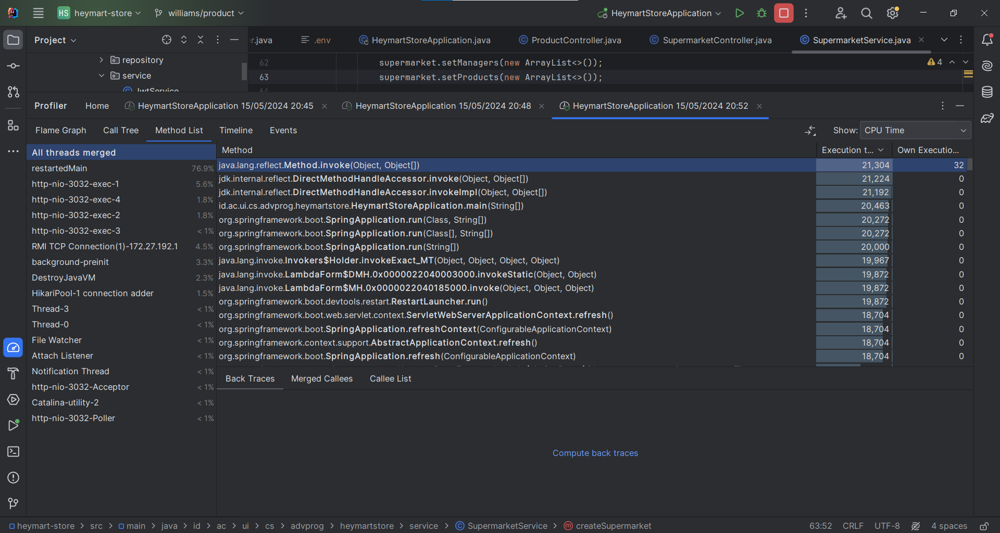
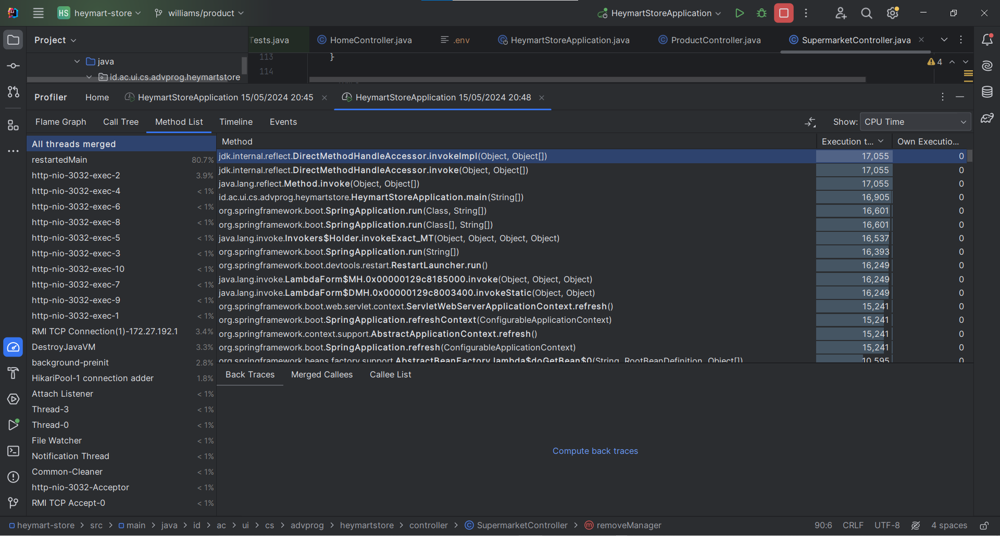

# Profiling Using IntelliJ Java Profiler

## Supermarket Get All Supermarket
- Information:
    - Seeded data: 1000
- Image

## Product Get All Product
- Information:
    - Seeded data: 1000
- Image

